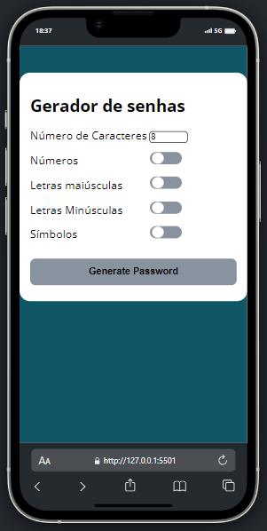
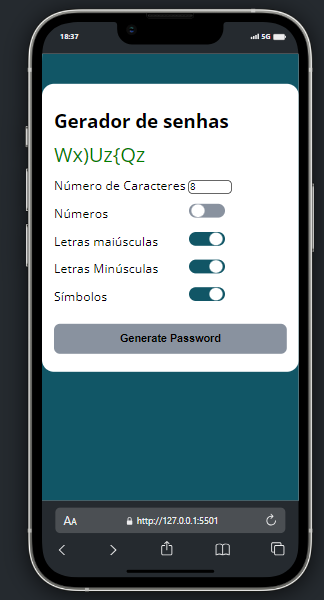
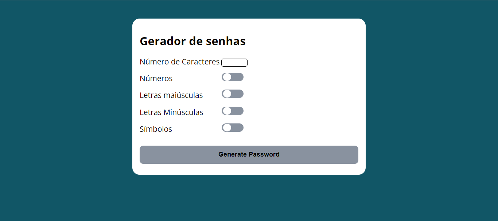

# Gerador de senhas 
[](https://github.com/GuilhermeHenrii/Password_generator/blob/main/LICENSE)

# Sobre o projeto

Esse projeto eu desenvolvi com o intuito de aprimorar minhas habilidades em com a lógica de programação e algoritmos. Um projeto simples porém bem desafiador.

## Layout mobile
 

## Layout web


# Tecnologias utilizadas
- HTML / CSS / JS

# Como executar o projeto

Pré-requisitos: VScode, Live Server

```bash
# clonar repositório
git clone https://github.com/GuilhermeHenrii/Password_generator.git

# entrar na pasta do projeto back end
cd password_generator

# executar o projeto
// Execute o live server no arquivo html na pasta public
```

# Autor

Guilherme Henrique da Silva Lopes

https://www.linkedin.com/in/guilherme-henrique-7aab6b229/
